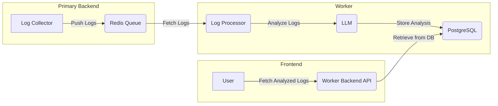

# AI-Powered Log Monitoring and Analysis System

## 📌 Project Overview
This project is designed to **monitor and analyze error logs** in an organization's infrastructure using AI-powered insights. The system consists of multiple components that work together to detect and analyze critical log events in real time, enhancing security and operational efficiency.

## 🎯 Aim of the Project
The primary goal of this project is to **automate log monitoring and analysis** while ensuring that the organization's master machine remains **secure and unexposed** to external threats. By leveraging **AI-driven insights**, this system helps in **detecting anomalies**, improving incident response time, and reducing **manual log analysis efforts**.

## 🏗️ Project Architecture
### **🖥️ Primary Backend (Log Collector Service)**
- Runs on the organization's **master machine** to monitor critical locations for **error logs** like:
  - **Syslogs, Auth logs, Error logs, Dpkg logs, API logs**
- Filters and pushes **only error-related logs** to **Redis queue** for processing.
- Ensures that the **master machine remains safe** from exposure over the internet, protecting it from potential attackers.

### **🔧 Log Processing Worker**
- A separate **backend service** that does the heavy lifting.
- **Pulls logs** from the Redis queue and sends them to an **LLM** for AI-driven insights.
- **Stores analyzed logs** and insights in a **PostgreSQL database**.
- Maintains a **WebSocket connection** to the frontend for real-time updates.

### **📊 Frontend (Real-time Log Dashboard)**
- Displays logs and their analysis in an interactive UI.
- Three key sections:
  - **Graph visualization** of log trends over time.
  - **Real-time logs feed** that updates as new logs arrive.
  - **Error analysis section**, where clicking a log fetches its AI-generated analysis in real time.

## 🏗️ System Architecture


## 🚀 **Getting Started**
### **Prerequisites**
Make sure you have the following installed:
- **Node.js** (v18+)
- **Docker**
- **Redis** (Standalone or Docker)
- **PostgreSQL** (Standalone or Docker)

### **📂 Clone the Repository**
```bash
git clone https://github.com/ronitsharma03/AI-smart-log-collector
cd ai-log-monitor
```

### **🔧 Setting up the Services**

#### **1️⃣ Using Docker (Recommended)**
```bash
docker run -d -e POSTGRES_PASSWORD=<mysecretpassword> -p 5432:5432 postgres
docker run -d -p 6379:6379 redis
```

#### **2️⃣ Running Services Manually**
If you are running **Redis and PostgreSQL locally**, make sure they are up and running before proceeding.

##### **🔹 Install dependencies**
```bash
cd primary-backend && npm install
cd ../log-processor && npm install
cd ../frontend && npm install
```

##### **🔹 Setup Database (Prisma Migration)**
```bash
cd primary-backend
npx prisma migrate dev --name 
npx prisma generate
```

##### **🔹 Start the services**
```bash
# Start Primary Backend (Log Collector)
cd primary-backend
npm run dev

# Start Log Processor (Worker)
cd ../log-processor
npm run dev

# Start Frontend
cd ../frontend
npm run dev
```

## ⚡ **Key Features**
✅ Secure log collection from critical sources.
✅ AI-powered log analysis using an LLM.
✅ Real-time visualization of logs and insights.
✅ WebSocket-based live data updates.
✅ Scalable architecture with Redis-based queueing.
✅ PostgreSQL-backed persistent storage.

---
📌 **Note:** This system is designed specifically for Veritas to enhance its **log monitoring efficiency**, **reduce manual overhead**, and **ensure infrastructure security**. 🚀
