# 🚀 AI-Powered Log Monitoring and Analysis System

## 📌 Project Overview
This project is designed to **monitor, analyze, and interact with error logs** in an organization's infrastructure using **AI-powered insights**. It consists of multiple components that work together seamlessly to detect, analyze, and report critical log events in real time, significantly enhancing security and operational efficiency.

## 🎯 Aim of the Project
The primary goal is to **automate log monitoring, analysis, and incident resolution** while ensuring the **master machine remains secure** and **isolated**.  
Through **AI-driven analysis**, it enables faster detection of anomalies, **reduces manual log checking**, and provides **intelligent solutions**.

---

## 🏗️ Project Architecture

### **🖥️ Primary Backend (Log Collector Service)**
- Runs on the organization's **master machine**.
- Monitors important logs:
  - **Syslogs, Auth logs, Kernel logs, Error logs, API logs**.
- Filters **only error-related logs** and **pushes them to Redis**.
- Maintains **machine security** by avoiding any direct database or external connections.

### **🔧 Log Processing Worker (LLM Integration)**
- A separate backend service responsible for:
  - **Pulling logs** from Redis.
  - **Analyzing logs** using **LLMs (Llama3 model)**.
  - **Storing logs + AI analysis** into **PostgreSQL database**.
  - **WebSocket integration** for real-time frontend updates.

### **📊 Frontend (Real-time Dashboard + Chat Interface)**
- **Live log feed** with AI-powered classification (error/info/warning).
- **Chatbot system** to query deeper insights about any analyzed log.
- **Graph view** for:
  - Timeline of errors.
  - Error frequency.
- **Clickable error logs** open a detailed **AI analysis chat window**.
  
### **📧 Email Scheduler**
- Sends **scheduled email reports** summarizing:
  - Number of errors detected.
  - Critical logs and analysis highlights.
  - Recommendations to system admins.

---

## 🛠️ Tech Stack

- **Backend**
  - Node.js
  - TypeScript
  - Express
  - Redis
  - PostgreSQL
  - Prisma ORM
  - WebSocket
  - Cron Jobs (for Email Scheduler)

- **Frontend**
  - React
  - TypeScript
  - Tailwind CSS
  - Recharts
  - shadcn/ui components

- **AI Integration**
  - Local LLM (Llama3) using Groq/Ollama APIs
  - JSON Structured Responses
  - Fallback Analysis if LLM fails

---

## 🏗️ System Architecture Diagram

```mermaid
flowchart TD
    %% Primary Backend
    A[Log Collector 📜]:::primary -->|Push Logs 🚀| B(Redis Queue 🛢️):::queue

    %% Worker
    B -->|Pull Logs 📥| C(Log Processor ⚙️):::worker
    C -->|Analyze with LLM 🤖| D(LLM API 🌐):::llm
    D -->|Store Analysis 💾| E(PostgreSQL 🗄️):::database
    C -->|Trigger Email Scheduler 📧| H(Email Service 📬):::email

    %% Frontend
    F[User Interface 🖥️]:::frontend -->|Fetch Logs 🔍| G(API Gateway 🚪):::api
    G -->|Query DB 🔎| E
    C -->|Send Real-time Logs 📡| F

    classDef primary fill:#dbeafe,stroke:#1d4ed8,stroke-width:2px;
    classDef worker fill:#dcfce7,stroke:#16a34a,stroke-width:2px;
    classDef llm fill:#fef9c3,stroke:#ca8a04,stroke-width:2px;
    classDef queue fill:#f3e8ff,stroke:#9333ea,stroke-width:2px;
    classDef database fill:#e0f2fe,stroke:#0284c7,stroke-width:2px;
    classDef frontend fill:#fcd34d,stroke:#f59e0b,stroke-width:2px;
    classDef api fill:#fde68a,stroke:#d97706,stroke-width:2px;
    classDef email fill:#fbcfe8,stroke:#db2777,stroke-width:2px;

```



---

## 🚀 Getting Started

### 📋 Prerequisites
- **Node.js** (v18+)
- **Docker** (for Redis and PostgreSQL)
- **Redis** (Standalone or Docker)
- **PostgreSQL** (Standalone or Docker)

---

### 📂 Clone the Repository
```bash
git clone https://github.com/ronitsharma03/AI-powered-log-monitoring-and-analysis
cd AI-powered-log-monitoring-and-analysis
```

---

### 🔧 Setting up the Services

#### 1️⃣ Using Docker (Recommended)
```bash
docker run -d -e POSTGRES_PASSWORD=<yourpassword> -p 5432:5432 postgres
docker run -d -p 6379:6379 redis
```

#### 2️⃣ Running Locally
Ensure **Redis** and **PostgreSQL** are running locally.

##### 🔹 Install dependencies
```bash
cd primary-backend && npm install
cd ../log-processor && npm install
cd ../frontend && npm install
```

##### 🔹 Setup Database (Prisma Migration)
```bash
cd primary-backend
npx prisma migrate dev --name init
npx prisma generate
```

##### 🔹 Start All Services
```bash
# Start Primary Backend
cd primary-backend
npm run dev

# Start Log Processor (Worker)
cd ../log-processor
npm run dev

# Start Frontend
cd ../frontend
npm run dev
```

---

## ⚡ Key Features

- **Real-time Log Monitoring**
  - Monitors multiple critical files.
  - Detects anomalies instantly.

- **AI-Powered Analysis**
  - Root cause identification.
  - Actionable, clear recommendations.

- **Interactive Chatbot**
  - Deep-dive into any log's analysis.
  - Ask custom queries based on context.

- **Graph Visualization**
  - Error frequency.
  - Timeline spikes and trends.

- **Email Scheduler**
  - Daily/Weekly reports to system admins.
  - Important alerts summarized automatically.

- **Fail-safe Mechanism**
  - Fallback analysis if LLM unavailable.

---

📌 **Note:**  
This system was developed as part of a project sponsored by **Veritas Technologies Pvt. Ltd.** to enhance **log monitoring efficiency**, **minimize downtime**, and **boost overall infrastructure security**. 🚀  

🔗 **GitHub Repository:** [AI-powered-log-monitoring-and-analysis](https://github.com/ronitsharma03/AI-powered-log-monitoring-and-analysis)

---

