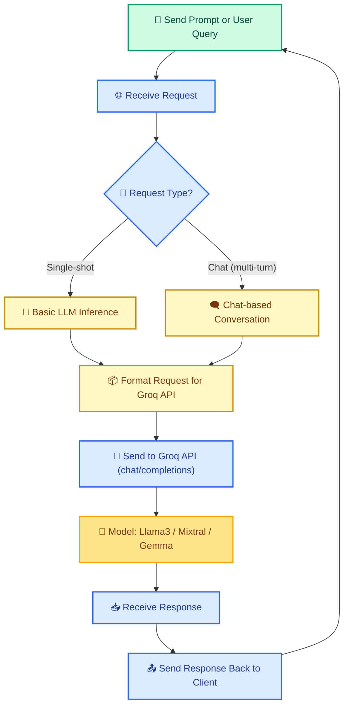

```mermaid
flowchart TD
    %% Client
    A1[💬 Send Prompt or User Query]:::client

    %% API Server
    B1[🌐 Receive Request]:::api
    B2{🔎 Request Type?}:::api
    B3[🧠 Basic LLM Inference]:::logic
    B4[🗨️ Chat-based Conversation]:::logic
    B5[📦 Format Request for Groq API]:::logic
    B6["🚀 Send to Groq API (chat/completions)"]:::api
    B7[📥 Receive Response]:::api
    B8[📤 Send Response Back to Client]:::api

    %% Groq LLM API
    C1[🤖 Model: Llama3 / Mixtral / Gemma]:::llm

    %% Flow
    A1 --> B1
    B1 --> B2
    B2 -->|Single-shot| B3
    B2 -->|"Chat (multi-turn)"| B4
    B3 --> B5
    B4 --> B5
    B5 --> B6
    B6 --> C1
    C1 --> B7
    B7 --> B8
    B8 --> A1

    %% Styles
    classDef client fill:#d1fae5,stroke:#059669,stroke-width:2px,color:#064e3b;
    classDef api fill:#dbeafe,stroke:#2563eb,stroke-width:2px,color:#1e3a8a;
    classDef logic fill:#fef9c3,stroke:#ca8a04,stroke-width:2px,color:#78350f;
    classDef llm fill:#fde68a,stroke:#f59e0b,stroke-width:2px,color:#78350f;
```