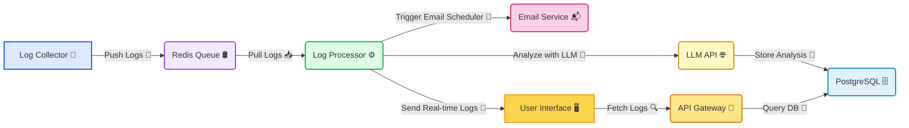

```mermaid
flowchart LR
    %% Primary Backend
    A[Log Collector 📜]:::primary -->|Push Logs 🚀| B(Redis Queue 🛢️):::queue

    %% Worker
    B -->|Pull Logs 📥| C(Log Processor ⚙️):::worker
    C -->|Analyze with LLM 🤖| D(LLM API 🌐):::llm
    D -->|Store Analysis 💾| E(PostgreSQL 🗄️):::database
    C -->|Trigger Email Scheduler 📧| H(Email Service 📬):::email

    %% Frontend
    F[User Interface 🖥️]:::frontend -->|Fetch Logs 🔍| G(API Gateway 🚪):::api
    G -->|Query DB 🔎| E
    C -->|Send Real-time Logs 📡| F

    classDef primary fill:#dbeafe,stroke:#1d4ed8,stroke-width:2px;
    classDef worker fill:#dcfce7,stroke:#16a34a,stroke-width:2px;
    classDef llm fill:#fef9c3,stroke:#ca8a04,stroke-width:2px;
    classDef queue fill:#f3e8ff,stroke:#9333ea,stroke-width:2px;
    classDef database fill:#e0f2fe,stroke:#0284c7,stroke-width:2px;
    classDef frontend fill:#fcd34d,stroke:#f59e0b,stroke-width:2px;
    classDef api fill:#fde68a,stroke:#d97706,stroke-width:2px;
    classDef email fill:#fbcfe8,stroke:#db2777,stroke-width:2px;

```
